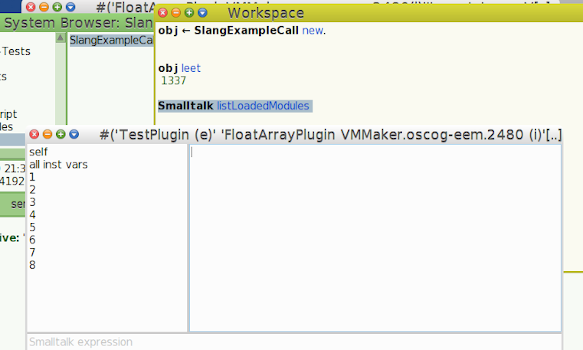
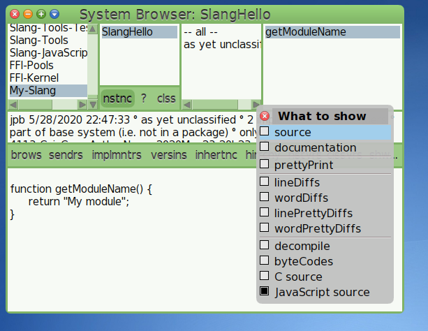
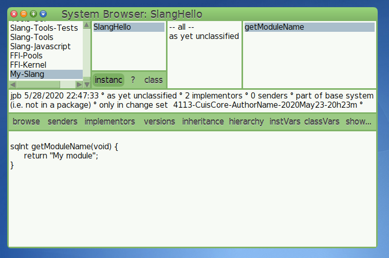

# Project journal

This file is intended to record the history of this project. So that
when it get's abandoned people can take it up again from where it was
left off. The rule of the structure is that newest is at top, oldest
entry is at the bottom. And people mention the author of the entry
by his shortcut. Also people add their shortcuts to the list of
authors at the end of the file.

# Entries

## 9th June 2020 (jpb)

Today I looked more at the C source of "cached" `Matrix2x3Pluign`, which
originally came from the opensmalltalk-vm repository. And I noticed that
the string returned for `getModuleName` also attaches a strange macro called
`INT_EXT` this turned out to add `(e)` for "external plugin" or `(i)` for
"internal plugin". I played around with the header again, added the stuff
which was needed from the `sqVirtualmachine.h` for the `Matrix2x3Plugin`
got it compiled and also loaded. And then I removed the cruft again
and my first handcoded simplistic external plugin got loaded as well.

I'm still puzzled why that now worked. Maybe because the working
directory was now the place where the `*.so` resides? But on my
first tries I actually considered that and copied the `TestPlugin.so`
to all the directories where I expected that the VM would look for it.



`primitive:module` calls for loading the module the function `ioLoadExternalFunctionOfLengthFromModuleOfLength`
in `sqNamedPrims.c`. Intereting.


## 8th June 2020 (jpb)

I added the `Matrix2x3Plugin` to the repository as [Juan on the mailinglist](https://lists.cuis.st/mailman/archives/cuis-dev/2020-June/001878.html) so that I can later look at it and get its C code
generated as a first try to get the external plugin generation running.


## 7th June 2020 (jpb)

Yesterday at 14:00 UTC was a Cuis Meetup using Jitsi. There I showed
a little bit the work I currently did.

After that I looked again at `sq.h` of opensmalltalk-vm and what is
really needed for a plugin to interface with the vm. Basically just
a minimal implementation of the `interpreterProxy` interface struct.
For which I build a `SlangOSVMHeaderBuilder` generator class, which
generates from the introspection of the running image a header,
which could in turn be used for building plugins together.

The interpreter proxy got over the years a couple of extensions and
luckily the VM returns back the major and minor versions of the
revisions which in turn are used for building the interpreter proxy
`struct` in the opensmalltalk-vm repository. So in theory, if the
opensmalltalk-vm maintainers don't massively mess that scheme up,
you can generate a `plugin.h` based on the return values of
`Smalltalk vmParameterAt: 70` (major version) or
`Smalltalk vmParameterAt: 71` (minor version).


## 3rd June 2020 (jpb)

Today I removed the `vm_exports` and `builtinfo` outputs, which
add the buildinformation or the different exported functions to
the generated module file. I think that should be differently done,
still I have no exact clue about it. But outputing something which
then needs at a different place a hardcoded `#include <stddef.h>` to
work with `gcc` is an opportunity for removal. I don't have the
nerves for this kind of annoyance.

Also I made per default the methods not `static` as in the first
step the `SlangCCodeGenerator` emits normal C code and for containing
most of the Smalltalk semantic methods are per default public, that
means in the context of C that they are visible to the outside world.
Luckily I didn't need to delete code for this, just change the defaults.


## 1st June 2020 (jpb)

I corrected the ordinal numbers in the journal, this particular nuance
of English is something I don't often use. In the morning I looked up
at [githut.info](https://githut.info) which languages have the most
bang for buck in terms of userbase. To make a pragmatic choice on
which languages are currently used and then generate to these target
languages, to get a wide reach.


Currently it seems if I or anybody invests time in building further
code generators then it's best (at the time of writing) invested in
building one for Java and then Swift. As Java is used on Android
for App development and Swift is used on IOS (take that Apple for
not allowing interpreter languages back in the beginnings).

I splited the C translation into its own package and the basic functionality
was put into Slang-Kernel. So that these things can be loaded independently,
when someone just wants to translate a specifc project to JavaScript and
then unloads it again afterwards. I'm not a big fan of over modularization,
but I hope I'm not doing that by just breaking modules not on a namespace
boundary but on a "functionality boundary". So put things in packages which
make in combination sense. Maybe the tests should be just put into Slang-Tests
as when you are testing you are normally using the whole stack. Something
to ponder.

I threw out the `generateBaseHeaderSize` slang generation methods, really
why are there special methods for that?! It's also nowehre used in the
opensmalltalk-vm repository. Also `bytesPerWord` not found, probably
long gone a long time ago. Other legacy Slang features which go
out of the door are:

- `preIncrement` and `postIncrement` as these are basically syntax
  sugar selectors for C and even there it's more safely used
  in loops but a bad idea outside them. So remove them.
  

## 31st May 2020 (jpb)

Today I found the time to finally a little bit adopt the code
which merged in from the VMMakerJS package, which originally came
from the SqueakJS project. And I fiddled with it and got the
JavaScript translation barely working so that it produces output.

And then I just added it to the `SlangBrowser` as a possible translation
target in a way which produces output, but it's still not correctly setup
to register it in an extendable fashion. I'm not a big fan of using
categories to extend an existing tool.




## 30th May 2020 (jpb)

I added the vmmaker javascript methods for generating from the parse
nodes the translated javascript code. I needed to get that stuff over
early as of the danger that these two APIs diverge too strong from each
other after my refactoring and I want to get javascript as early as
possible in or else I have reproduced the state in the vmmaker again.

What I have noticed in the VMMakerJS code is that it awfully reads
like a bunch of hacks as it seems to have been copied from the 
`CCodeGenerator` 1:1 and then was modified so that it somehow could
generate JavaScript.

I read this post by David T. Lewis (dtl) on the cuis-dev mailinglist
about a set of changes to the vmmaker to allow [browsing](https://lists.cuis.st/mailman/archives/cuis-dev/2020-May/001797.html). This inspired me to add to Slang the `SlangBrowser` as this is how
Cuis expects to extend the `CodeProvider` where actually all the
messages for showing the bytecodes, the source, the prettified source
and so on are defined. So I needed to do a subclass of the subclass
of it, which was `Browser`.

And tada, here I get a preliminary result, it still needs a class which
is a subclass of`SlangModule`as input as there is the only class on which
the special method `prepareToBeAddedToCodeGenerator:` was defined. In
VMMaker this method is bolted on the `Object` and I'm not a fan of this
way of extending functionality by bolting arbitrary methods on objects,
which in turn makes their interface cluttered. So let's see if I find
a better way of adding Slang translations besides just subclassing
`SlangModule`.

Here is a picture of the SlangBrowser running, the window was created
with the expression:

```smalltalk
BrowserWindow open: SlangBrowser new label: 'Slang'.
```

Result:




## 29th May 2020 (jpb)

Removed the `stream cr` and replaced them with `stream newLine` which 
caused that this first whimsical code generation had carriage returns (CR)
instead of proper linefeeds in there. This is such a small change which
did Cuis in my opinion right. Not emulating an OS which prints out CRs to
end lines, but to model the concept of adding ending a line and starting a new
one.

## 28th May 2020 (jpb)

In the morning during breakfast I looked at this [ZeroMQ](https://zeromq.org/get-started)
example of writing a hello world server in ZeroMQ:

```c
//  Hello World server
#include <zmq.h>
#include <string.h>
#include <stdio.h>
#include <unistd.h>
#include <assert.h>

int main (void)
{
    //  Socket to talk to clients
    void *context = zmq_ctx_new ();
    void *responder = zmq_socket (context, ZMQ_REP);
    int rc = zmq_bind (responder, "tcp://*:5555");
    assert (rc == 0);

    while (1) {
        char buffer [10];
        zmq_recv (responder, buffer, 10, 0);
        printf ("Received Hello\n");
        sleep (1);          //  Do some 'work'
        zmq_send (responder, "World", 5, 0);
    }
    return 0;
}
```

and my first try of rewriting that example into a possible(?)
translation into Slang by hand turned out like this:


```smalltalk
main
    | context responder rc |
    context := environment perform: 'zmq_ctx_new'.
    responder := environment
        perform: 'zmq_socket'
        with: context
        with: (environment resolve: 'ZMQ_REP').
    rc := environment
        perform: 'zmq_bind'
        with: responder
        with: 'tcp://*:5555'.
    
    self assert: rc = 0.
    [
        | buffer |
        buffer := ByteArray new: 10.
        environment perform: 'zmq_recv'
            with: buffer
            with: 10
            with: 0.
        environment
            putString: "Received Hello'.
        environment
            sleepWith: 1. "Do some  work"
        environment
            perform: 'zmq_send'
            with: responder
            with: 'World'
            with: 5
            with: 0.
    ]
```

It's longer with the `perform` style, but I think it makes the
distinction between "me the object" and "the environment".

I removed the `macro:` pragma, as it in the current `Slang-Tools`
subset of Slang it wasn't used anywhere really, besides querying
for it with `definedAsMacro` or in the code generators `addMacro:for:`.
Let's see how we can solve the purpose of these methods in a different
way. And also `option:` pragma, as I didn't understand it and it was
nowhere used. It seemed to look up classes and evaluate them, but
the reason behind this is unknown to me.

`isNonArgumentImplicitReceiverVariableName:` and `mustBeGlobal:`
wer thrown out of the objects as they went to the class and said
"hey is `interpreterProxy` implicitly defined in yourself?" or
"hey is variable X supposed to be global?" these things should
not be stored on the class side, more in the type of the plugin
generator. Without these extensions any Object which sends the
Slang messages can be used for generating code.

I managed to get a really crappy "Hello World" module generated,
one class with one method called `getModuleName` which returns
a string was generated with:

```smalltalk
gen := SlangCCodeGenerator new.
gen addClass: SlangHello.

gen emitCCodeOn: 'slang_test.c' asFileEntry writeStream
	doInlining: false
	doAssertions: true.
```

and the result was:

```C
/* Slang Generator */^M/* Automatically generated by
SlangCCodeGenerator Slang-Tools
   from
        Main comment stating the purpose of this class and relevant relationship to other classes.

Possible useful expressions for doIt or printIt.

Structure:
 instVar1               type -- comment about the purpose of instVar1
 instVar2               type -- comment about the purpose of instVar2

Any further useful comments about the general approach of this implementation.
 */
static char __buildInfo[] = "Main comment stating the purpose of this class and relevant relationship to other classes.

Possible useful expressions for doIt or printIt.

Structure:
 instVar1               type -- comment about the purpose of instVar1
 instVar2               type -- comment about the purpose of instVar2

Any further useful comments about the general approach of this implementation. " __DATE__ ;

^M/*** Constants ***/^M/*** Function Prototypes ***/^Mstatic sqInt getModuleName(void);^M/*** Variables ***/

^Mstatic sqInt getModuleName(void) {^M  return "Slang Hello World";^M}

void* vm_exports[][3] = {
        {NULL, NULL, NULL}
};
```

A broken starting point. But anyway a starting point. The next
steps will be more "wash & repeat" until the solution is improved.


## 27th May 2020 (jpb)

I moved yesterday most of the classes to which could in theory be
adapted to generate a plugin to the Slang-PluginMaker, which will
be probably be deleted at some point completly. As plugins aren't
advised by folks on the Squeak VM mailinglist to begin with and are
just old tightly coupled balls of rubber band.

Eliot Miranda also pointed out in the [vm-beginners](http://forum.world.st/Stability-of-the-external-plugin-interface-td5117112.html) in a private mail that I wouldn't need Squeak FFI on Cuis as
it's supposed to be supported here:

> I don’t understand where you get the idea that Cuis has no callbacks.
> Cuis supports Alien and has access to the ThreadedFFIPlugin and runs on
> Cog, so it can have callbacks easily.  I suspect they’re there if you
> load FFI and Alien.  Ask on the Cuis list.
>
> In a Squeak image look at Alien’s class side exampleQsort which uses a
> callback to implement the sort function to qsort.  I bet this works on
> Cuis too.

Probably from the VM side, but I never have seen
it in action I only saw the FFI package and that doesn't look like
Alien or threaded FFI. But on the other hand I don't know Alien
and found the uFFI of pharo hard to understand and hard to use.
I had less problems with the FFI of Cuis, which  is as thought the
old SqueakFFI. On the other hand I haven't wrote any FFI code for
now almost one year. A timespan where you can forget an API easily.

I asked then on cuis dev mailinglist as Eliot advised and quoted
the above private mail, which I didn't realize at the time of
quoting it, that it was a direct private mail. I got an mailinglist
[answer](https://lists.cuis.st/mailman/archives/cuis-dev/2020-May/001737.html)
by Juan Vuletich, that I understood as "ThreadedFFI, Alien is not
implemented in Cuis, only the old SqueakFFI".

So let's summarize my current desing opinios:

1. Specialize on FFI Plugins first, as this is my current usecase I want
   to have in Slang.
2. Allow any object which implements the Slang selectors to be able to
   be translated using a code generator to a target language.
3. Remove all the old gunk from Slang. As it hinders
   development and introduces magical thinking about the codebase
   as most of the added functionality in there was tailored to the
   VMMaker.
4. Extract out the stuff which is more system specific and move it
   into a replaceable adapter object (`SlangSystemAdapter`).
5. Remove C specific part as it hinders switching out the translation
   code generator. For example I have peaked over what Vanessa Freudenberg
   and others wrote in the SqueakJS VMMaker and it tries to wiggle around
   the C constructs in Slang, which is not ideal.
   
Ok, finally I removed following selectors, as these are very C specific
and harder to map to other languages:

- `isDefined:inSmalltalk:comment:ifTrue`
- `cCode:inSmalltalk:`
- `cppIf:ifTrue:ifFalse:`
- `isDefined:inSmalltalk:comment:ifTrue:ifFalse:`
- `isDefined:inSmalltalk:comment:ifTrue: .`
- `isDefinedTrueExpression:inSmalltalk:comment:ifTrue:ifFalse:`
- `preprocessorExpression:`
- `cPreprocessorDirective:`

Let's see if I can find replacements for these valid concepts,
but in the end they are are an ad-hoc solution to the actual
problem of working with `#ifdef`, `#define X`, `#pragma` constructs,
how can we keep these language constructs out of Slang, so that they
don't leak into the system? If you remove them you have a proper object
which can do things and not some thing which is only good for being
translated to C.


## 26th May 2020 (jpb)

Another from yesterdays squeak-vm mailinglist thread, it just seems
to have a little bit of momentum. Interesting quote by Tim Rowledge:

> VW has a parser of C header files that is I suppose the right way to
> do this sort of thing - you parse the headers (warning - I seem to
> recall parsing 'windows.h' taking several days in the original VW ddl
> product) and build proxies of all the types/structs/etc.  Is that a
> practical way to do it? Hell of a lot of work to do, certainly.

I mean the actual real right way of doing that is not to parse any
headers, module definitions in source code in any third part programming
language but to ask an interface "give me the methods with typenames,
enums and constants you export and support" and it returns to you in
an uniform way. Parsing external source is a rather clunky way of
doing it, you can do that for each time you want to interact with
a different programming languange. There are now possible candidate
programming languages around: Go, Java, Python, Rust, JavaScript,
C, C++, Ada. So eight parsers to write, really who has the time for
that? Something like OMeta or PetitParser makes that easier, but it's
still work and for what gain? Added complexity.


## 25th May 2020 (jpb)

I peeked into the original back to the future paper, there
Slang was defined as using these methods:

```smalltalk
& | and: or: not+ - * // \\ min: max:bitAnd: bitOr: bitXor:
bitShift:< <= = > >= ~= ==isNil notNilwhileTrue: whileFalse:
to:do: to:by:do:ifTrue: ifFalse: ifTrue:ifFalse: ifFalse:ifTrue:at:
at:put:<< >> bitInvert32 preIncrement integerValueOf:integerObjectOf:
isIntegerObject:
```

There are a couple of things which are not in the current spec,
no `cCode:` or `cCoerce:`, etc. I think because of that, that the
`c*` methods should be ideally kicked out of Slang, these things
weren't in the original specification and also feel bolted on
currently.

I asked on the [vm-beginners squeak mailinglist]http://forum.world.st/Stability-of-the-external-plugin-interface-td5117112.html) about of how stable the external plugin interface is. And
the advice was to stay away from it and use FFI, because it's
more like a bad solution. It's insecure, expensive to maintain,
painful to use and hard to package, I think that could summarize
it. There are multiple proposed solutions to this problem of talking
to the outside non-Smalltalk-world, which yet aren't production ready.
How do I deal with this? Waiting is not an option, any solution of
this needs to be flexible enough to deal with the current and
future situation. Oh boy, more design requirements. Good that I'm
still in the early toying around stage.

So maybe just building a `SlangFFIPluginGenerator` which takes a
Slang plugin and translates it into the code for the FFI use? Maybe
a `SlangExternalPluginGenerator` which takes the same code and builds
a safe version of a plugin? For this design to work, you MUST NOT code
up a situation where the input Slang module has internal dependencies
sticked on it, like it's currently the case in VMMaker Slang.

Hmm, the post on the mailinglist wasn't just put on the vm-beginners
mailinglist but also on the [vm-dev mailinglist](http://forum.world.st/Re-Vm-beginners-Stability-of-the-external-plugin-interface-td5117148.html), I just noticed. I'm not at the time of writing
a member of the vm-dev mailinglist. Anyway in that thread there are
couple of noteworthy quotes:

> The VM plugins were an attempt to get away from a few problems that
> plagued VM development at the end of the last millennium (and I
> don't mean March this year) with things like a limited number of
> prim table entires, the lack of flexibility a static table
> engendered, the time it took to compile an entire VM for a tiny
> change/test cycle etc (IIRC of the order of half an hour back then).

Which answers why the VM isn't generated each time from Slang, it
just was too slow to build the whole thing for each platform from
source (1/2 hour).

> We were also starting the beginnings of the ffi stuff around
> then. Andy Greenberg came up with the SmartSyntaxPlugin stuff, for
> example, at the end of '99

So `SmartSyntaxPlugin` is from 1998, as the first Squeak VMMaker
version stamps.

> Moving to ffi-only would allow removing a fair bit of cruft from the
> VM, though there's our old friend 'backward compatibility' to argue
> with.

Oh.. now I get the feeling that the discussion hit a nerve, which was
stressed over years of repeated damage.

Hmm also an interesting contribution from Tobias Pape:

> When I tried to get the Self VM running again some years ago, one of
> the agonizing parts was its extensive use of FFI. Why so? Well, the
> FFI was coded against a mid-1990 X11. Which, in that form did not
> exist on either Mac nor Linux. Some parts worked, but a lot of things
> needed attention in _both_ the VM _and_ the Image. In some respect,
> the "libraries interfaced via FFI" had moved faster than the VM.
> 
> Had Self had a Display Plugin just like Squeak, changes would have
> been much more simple, since the assumptions in the Self world had nod
> changed at all.
> 
> So, if things move slowly in VM/Image land and more quickly in library
> land, the answer is Plugins.  If things move quickly in VM/Image land
> and are stable in library land, the answer is FFI.

So.. sometimes plugins have their place?

In any way FFI or plugins are just a way to link to some library support
code. From my point of view you can't currently directly link any library
with either FFI or plugins into an image and it will work, some conversion
layers will be present as no library fits snuggly.


## 24th May 2020 (jpb)

I looked into `sqNamedPrims.c`in the current opensmalltalks-vm
master branch and it seems that there are a couple of methods
which are called for named modules:

- `EXPORT(const char*) getModuleName(void)` for retrieving the module name
- `EXPORT(sqInt) setInterpreter(struct VirtualMachine *anInterpreter)`
  for associating the module with an interpreter proxy.
- `EXPORT(sqInt) initialiseModule(void)` for module setup
- `EXPORT(sqInt) shutdownModule(void)` for module cleanup

These only the `setInterpreter` callback is mandatory, the
`getModuleName` is optional, but the VM will complain. The
`initialiseModule` callback is optional, but when it's present
the function needs to return a positive integer value for
showing to the VM that the initialisation was a success or
else it will notify about an error. `shutdownModule` needs
to return a number higher than 0 to signal to the VM that
it correctly shut down.

`EXPORT(x)` seems to a macro which returns depending on the
compilation module `x` or `static x`. This depends in some
plugins on the macro `SQUEAK_BUILTIN_PLUGIN` or in other
words `EXPORT(x)` is used in the VMMaker to distinguish
when it comes to plugins if they should be generated
intern to the VM or extern as a dynamic loaded library.
For the usecase I would want to have this around are the
internal options totally not interesting. Any external plugin
generation should be focused on having a robust hopefully
external code generation.

The plugin search path can be configured with the env variable
`SQUEAK_PLUGINS` and the `-plugins` vm option. Per default
the vm searches in the vm directory.

How do I get the `InterpreterProxy` which is defined in
`platforms/Cross/vm/sqVirtualMachine.c` to interact with
outside Cuis Slang code without re-implementing the VM?
When it comes to later simulations of plugins, they can't
be simulated over the interpreter proxy as this would mean,
to simulate the VM. And how to transport the C interface
of plugins safely, without caring around the
VMMaker + the Opensmalltalk VM repository which are 300 MB.
Call me old fashioned, but this is a little bit too much for
building plugins for my taste. And I say that in a time
where it's normal to download Gigabytes of libraries only
to build an Android or IOS App.

`storeVirtualMachineProxyImplementation: categoryList on: fileName`
of the `VMPluginCodeGenerator` is a very old method. Goes back
to 1998, maybe it's even older than that, but that was the first
commit in the VMMaker repository. The remarkable about this method
is that it's called nowhere from the codebase, but it seems to have
been used to generate the `sqVirtualmachine.c` file which contains
the `sqGetInterpreterProxy` C function which is generated during
the execution of this legacy method. VM developers maybe sometimes
generate that file from this generator method. Fascinating what
gems you sometimes find.

The `sqVirtualMachine.h` defines the structure of an `InterpreterProxy`,
this header depends on two files implicitly `interp.h` and `config.h`.
`interp.h` gets generated by the `CCodeGeneratorGlobalStructure` aha! for that this
generator is around! `config.h` seems to be defined per build, maybe
generated by autotools? 

In `CCodeGeneratorGlobalStructure>>emitCVariablesOn:` is one of
the places where `isGeneratingPluginCode` is used for generating
code depending on the value of this method, there are triggers
for the interpreter proxy which is then handled special. As
this code is involved in generating C source for the `interp.c`
file I remove `isGeneratingPluginCode`and all the attached cases
which use this flag as I don't need to generate a VM, just plugins.


## 23th May 2020 (jpb)

Today there was a Jitsi Meeting with Cuis developers and the
topic of a faster call of external libraries came up. For this
case the current old Squeak FFI interface which is used by
Cuis is for rapid callbacks too slow as it seems to do too much
conversions. So the case for packaging external libraries as
external VM plugins came up. To my suprise there would be a
concrete usecase for my current extracting efforts of Slang
as I would also want to use it for calling a library.
That's energizing, but sadly also stressful. How do I get
that done correctly?

What makes a `SmartSyntaxPlugin` "smart"? It seems to generate
code in a different way, but that is the only thing I can deduce
from skimming over it. It adds again multiple special typecasting
methods on different object classes, which isn't great.

In theory you would want to generate code which can be fed into
the VM and which respects its interfaces, but doesn't depend
on the internal structure of the VMMaker package. But I fear
this is not going to happen? As for external plugins the
class to use seems to be the `SmartSyntaxPlugin` and its code
generator. They in turn are depending on the interpreter proxy
which depends on other things and so we could have again the
whole VMMaker here. Not an optimal situation it seems there
must be an interface defined as "how it is" so maybe one generated
Plugin Template from the opensmalltalks-vm subdirs and tested against
that and hoped that this interface won't break in the future.


## 21st May 2020 (jpb)

Today I wrote a small [Design document](docs/Design.md) which has
only the intention of showing what is the broad structure of the
Slang package, when I don't lose focuse I'll add to it during the
progress of this "enterprise".

I found and interesting tutorial about writing interpreters in
[PyPy](https://morepypy.blogspot.com/2011/04/tutorial-writing-interpreter-with-pypy.html)
which can contribute a couple of ideas of using it at some time in
the future, IF the project progresses that far, for how Slang is
supposed to feel like when writing an interpreter. Usability is a big
thing.

Renamed `isTypePointerToStruct:` to `isTypedPointerToStruct:`, because
I think it reads a little bit more nicely. As it's about the the pointer
is typed and not the type pointer .. whatever. I added a specialized
repository for looking up types called `SlangCTypeRepository` for handling
these issues as currently this is implemented by delegating wild into the
class hierarchy and returning `false` on an error if `isTypePointerToStruct:`
is not implemented. This is according to my always flawless taste about code
(That is supposed to be ironic) the better choice of handling this.

I renamed `cCoerceSimple:to:` to `coerceSimple:to:` as this fits more
into my interpretation of Slang. When writing code I don't want to always
say with my method usages, that it's a C construct. I mean type coercion
is not in this case a C construct, but a Slang construct. So what is Slang?
Surely a typed language with really simple types like integers, strings,
structs, pointers and arrays. Which can be implemented on the translation level
with some hacks ontop of other languages which implement some superset of C.

What really would be interesting is if you could pass into a code generator
any object and it will try to translate it to C or any supported programming
language. So that would mean in that case, that the input object is written
in a way, which is "almost Slang" as only something supported in Slang
could be translated. That would be an intriguing property, but how would you
do that without changing the input object? In the past Slang inlined it's
methods under the "*VMMAker C translation" category on the `Object` class,
which made all objects potential inputs, but do I need to do that?


## 20th May 2020 (jpb)

Yesterday I removed a couple of unreferenced methods, which sometimes
weren't even referenced in the Squeak VMMaker image I have here to
check against certain in Cuis unimplemented methods like 
`#monticelloDescription`. I removed them or rewrote them, I still
need to do that a couple of times until I covered all the small
part which I initially extracted from VMMaker. You can easily get
lost in the codebase. All these conversions from translation methods
which call arbitrarily methods on the code generator and so on.

The CodeGenerator is a big class, too big actually. It does a lot of
stuff and has the feeling of a control box of some sort where a lot
of high-voltage loaded wires stick out and you don't touch them or
you get electrocuted.

Good that I'm not intending to be compatible with the VMMaker,
that would make any change hard and I'm doing that in my free time,
why should I endure pain which I only accept for payment? That's
also the charme of Cuis Smalltalk, saying a big fat NO! To
realities of software development. In the end it's the only
way to go longterm, to restructure parts of a software system
so that the authors understand it again.

Got some nice feedback from Juan:

> I also think it is a great idea. I always thought that VMMaker should be 
> split in several packages, one of them PluginMaker part (Not support for 
> the whole vm, GUI, simulation, but just slang to c conversion for 
> plugins). PluginMaker should be easy to port to all Squeak dialects.
>
> Cheers,
> Juan Vuletich

Well, then this gives atleast some input of how, if I find
the motivation, to proceed this project.

I added further testcases to the codebase. Removed other not
referenced methods, it's sad to remove stuff which seems to
have hooks in the VMMaker, while barely understanding the
inner workings of the whole system. But when it's not referenced
in this subworld then it's not needed in my world.


## 18th May 2020 (jpb)

Today I added an FAQ and this journal at the end of the day. I also
updated the current work image of it, without yet checking in again.

I wonder how I can restructure core of Cuis Slang with making it
actually understandable and still retain an almost correct resemblance
with the VMMaker Slang. Should it even be compatible? Should it burn
bridges? Would it then not be better to just use one of the other
lowlevel highlevel languages? Lowtalk? An easy scheme variation? SBCL?

There must be a position in between these extremes of writing a full
fledged implementation of a lowlevel programming language and no
implementation at all!

What is the reason for doing this? The initial stuff I did was to
extract the core of slang out of Cuis VMMaker over the weekend and
changed it around so that some of the existing tests passed. I
want to bundle plugins with Cuis packages and putting everything
needed for that into that package. Storing C code into strings
and serializing them out to the filesystem for compilation is
error prone and ugly. Using a full language implementation get's
easily out of hand and requires a context switch in the head for
writing it, then I would prefer to just code the plugin in C and
include the C files and header files with the package.

I need to make up my mind. What is the exact project scope?
I want easier FFI plugins, I want to ability to take one piece
of code and let the system handle the translation to a different
programming language, so I don't want to write again the same thing
again and again over and over.

Well, maybe this project is a documentation of why this dream
of transpiling, not writing code twice or simulation based development
is just a pipedream of idealists.

That could make it worth doing.


# Authors

- Josef Philip Bernhart (jpb)
